# Project Title

Simple Web Server

## Getting Started
A Java-based web server that supports handling multiple concurrent requests and serves static files such as HTML, CSS, JavaScript, and images. It also includes asynchronous communication with REST services on the backend.

### Installing

1. git clone https://github.com/cristiandavid0124/Lab1-Arep.git

2. Build the Project
Ensure you have Maven installed. Build the project using:

mvn clean install

## Deployment
1. Start Server
You can run  java -cp target/miprimera-app-1.0-SNAPSHOT.jar WebService
2. Access the Web Application 
Open your web browser and navigate to http://localhost:8080/index.html to see the application in action.

## Built With

* [Maven](https://maven.apache.org/) - Dependency Management

## Main Components
1. RestService  This is an interface that defines the methods that must be implemented by any class that handles REST services.
2. WebRest Implements the RestService interface and provides the logic for handling specific REST requests. In your case, it manages a list of players in JSON format.
3. WebService  Starts and manages the web server. Listens for incoming requests and delegates the handling of these requests to appropriate RestService instances

## Static Files
 1. index.html: The main HTML page for the web application. It includes a button to fetch data from the REST endpoint and a form to submit data via POST.
 2. styles.css: Contains the CSS styles for the web application, providing a responsive and user-friendly interface.
 3.  app.js: JavaScript file that handles asynchronous requests and updates the DOM based on user interactions.

 ## Testing
 In the workshop I proposed creating a simple web app in which you can save soccer players, see how many soccer players there are, delete players and finally edit these players.

 1. add player 
 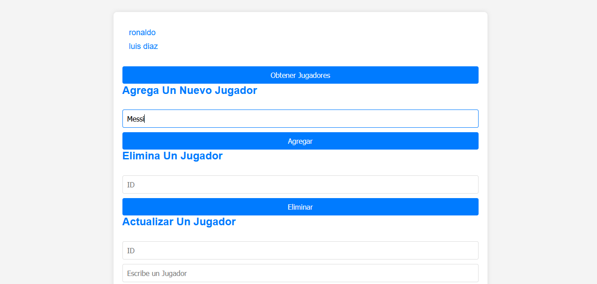
 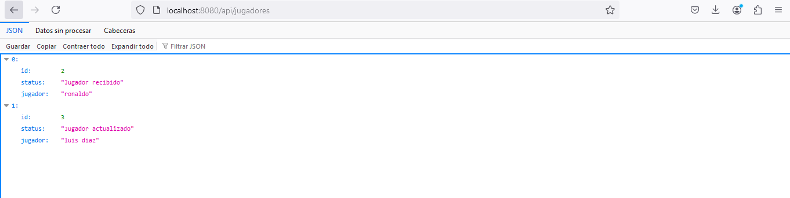
 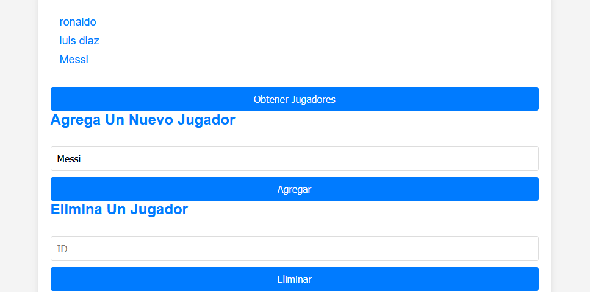
 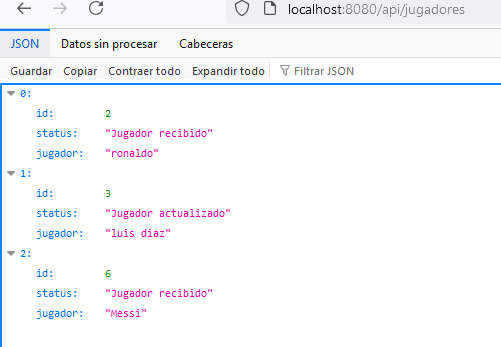

 2. delete player 
 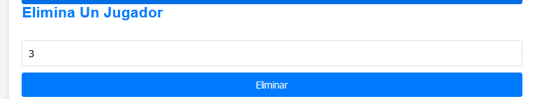
 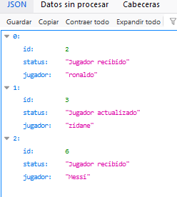
 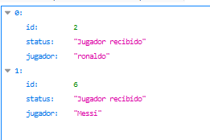

 3. update player 
 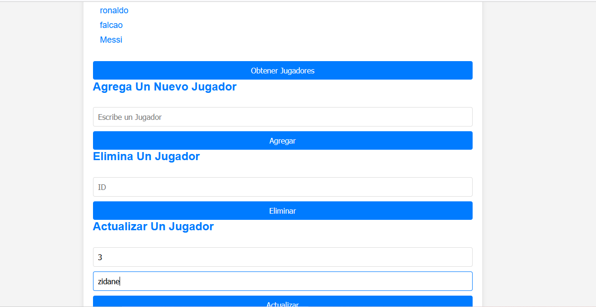
 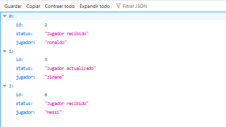
 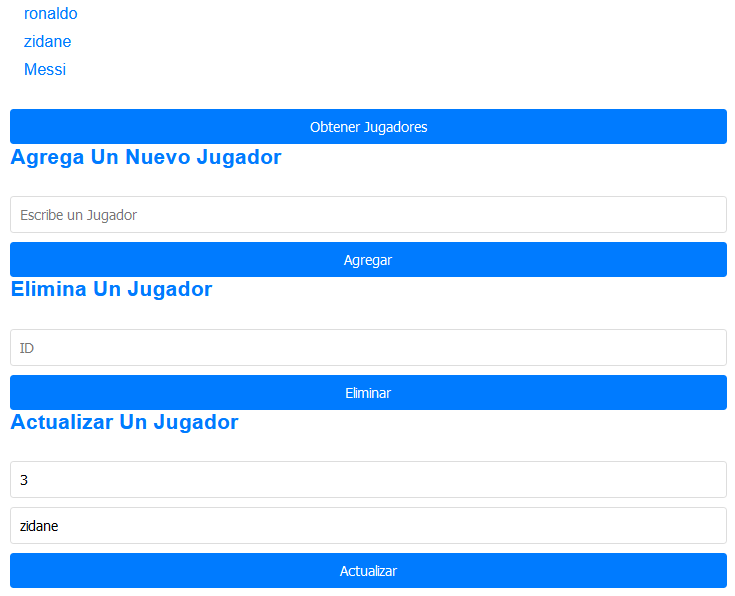

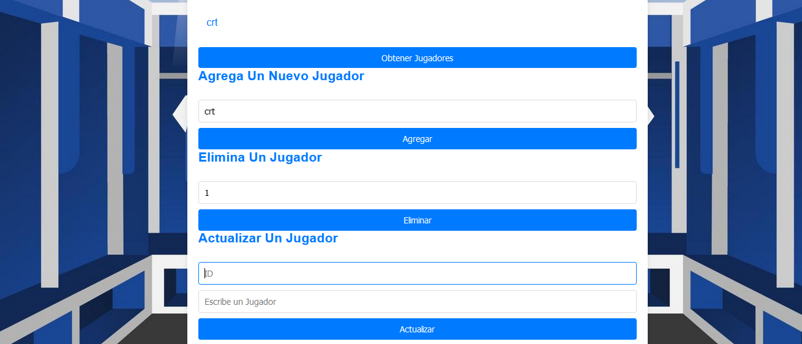

## Autor
Cristian Naranjo - Developer and Author of the Project
